# ⚖️ Legal AI Document Analysis System


A comprehensive **Agentic AI System** that transforms complex legal documents into clear, accessible insights. Built for the Google GenAI Exchange Hackathon with a multi-agent architecture that simplifies legal document analysis through intelligent summarization, clause extraction, and natural language Q&A.

## 🌟 Features

### 🔍 **Document Processing**
- **Multi-format Support**: PDF, DOCX, and TXT documents
- **Intelligent Chunking**: Semantic document splitting for optimal processing
- **Vector Storage**: Pinecone-powered semantic search and retrieval

### 📊 **Multi-Level Summarization**
- **Overall Summaries**: High-level document overview
- **Section Summaries**: Detailed breakdown by document sections
- **Clause-Level Summaries**: Granular analysis of individual clauses

### 📜 **Smart Clause Extraction**
- **Obligations & Rights**: Identify what each party must and can do
- **Penalties & Consequences**: Extract penalty clauses and breach conditions
- **Timelines & Deadlines**: Important dates and time-sensitive requirements
- **Termination & Renewal**: Contract lifecycle management terms
- **Payment Terms**: Financial obligations and payment schedules

### 📖 **Legal Term Definitions**
- **Auto-Detection**: Automatically identify complex legal jargon
- **Plain English**: Convert legal terms to understandable language
- **Contextual Explanations**: Definitions tailored to document context
- **Related Terms**: Discover connected legal concepts

### ❓ **Intelligent Q&A**
- **Natural Language**: Ask questions in plain English
- **Citation-Backed**: Answers include relevant source references
- **Conversation History**: Maintain context across questions
- **Related Suggestions**: AI-generated follow-up questions

### 🎯 **Smart Routing**
- **Intent Classification**: Automatically route queries to appropriate agents
- **Multi-Agent Coordination**: Seamless handoffs between specialized agents
- **Session Management**: Persistent state across user interactions

## 🏗️ Architecture

### Multi-Agent System Design

```mermaid
graph TB
    User[👤 User] --> Frontend[🖥️ Streamlit Frontend]
    Frontend --> API[🔌 FastAPI Backend]
    API --> Router[🎯 Routing Agent]
    
    Router --> DocAgent[📄 Document Retrieval Agent]
    Router --> SumAgent[📊 Summarization Agent]
    Router --> ClauseAgent[📜 Clause Extraction Agent]
    Router --> DefAgent[📖 Definitions Agent]
    Router --> QAAgent[❓ Q&A Agent]
    
    DocAgent --> Pinecone[(🔍 Pinecone Vector DB)]
    DocAgent --> Storage[(💾 Document Storage)]
    
    SumAgent --> Gemini[🤖 Gemini 2.5 Flash]
    ClauseAgent --> Gemini
    DefAgent --> Gemini
    QAAgent --> Gemini
    
    API --> Database[(🗄️ SQLite Database)]
```



### Agent Responsibilities

| Agent | Purpose | Key Functions |
|-------|---------|---------------|
| **Document Retrieval** | Document processing & search | PDF/DOCX/TXT parsing, embedding generation, semantic search |
| **Summarization** | Multi-level summaries | Overall, section-wise, and clause-level summarization |
| **Clause Extraction** | Structured clause analysis | Extract obligations, rights, penalties, timelines, etc. |
| **Legal Definitions** | Term explanation | Auto-detect and define legal jargon in plain English |
| **Q&A** | Document querying | Natural language Q&A with citations |
| **Routing & State** | Central coordination | Route requests, manage sessions, coordinate agents |

## 🚀 Quick Start

### Prerequisites

- Python 3.10+
- Google Gemini API Key
- Pinecone API Key
- Git

### 1. Clone Repository

```bash
git clone <repository-url>
cd AILegalAssistant
```

### 2. Setup Environment

**Linux/Mac:**
```bash
chmod +x setup.sh
./setup.sh
```

**Windows:**
```batch
setup.bat
```

### 3. Configure API Keys

Edit `.env` file:
```env
GOOGLE_API_KEY=your_google_api_key_here
PINECONE_API_KEY=your_pinecone_api_key_here
PINECONE_ENVIRONMENT=your_pinecone_environment
PINECONE_INDEX_NAME=legal-documents
```

### 4. Start the System

**Backend (Terminal 1):**
```bash
source legal_ai_env/bin/activate  # Linux/Mac
# or legal_ai_env\Scripts\activate  # Windows

cd backend
python main.py
```

**Frontend (Terminal 2):**
```bash
source legal_ai_env/bin/activate  # Linux/Mac
# or legal_ai_env\Scripts\activate  # Windows

streamlit run frontend/app.py
```

### 5. Access the Application

Open your browser to: **http://localhost:8501**

## 📖 Usage Guide

### 1. **Document Upload**
- Click "Browse files" in the sidebar
- Select a legal document (PDF, DOCX, or TXT)
- Click "Process Document"
- Wait for processing to complete

### 2. **Document Summary**
- Navigate to "📄 Document Summary" tab
- Choose summary type: Overall, Section, or Clause
- Click "Generate Summary"
- Review the structured summary and key points

### 3. **Clause Extraction**
- Go to "📜 Clauses & Terms" tab
- Select specific clause types (optional)
- Click "Extract Clauses"
- Browse organized clauses by type with importance scores

### 4. **Legal Definitions**
- Visit "📖 Legal Definitions" tab
- Enter terms to define (one per line)
- Add context if needed
- Get legal and plain English definitions

### 5. **Ask Questions**
- Open "❓ Ask Questions" tab
- Type your question in natural language
- Review the answer with confidence score
- Check citations and related questions

## 🔧 API Documentation

### Core Endpoints

#### Document Management
```http
POST /upload_document
GET /document/{document_id}
GET /documents
DELETE /document/{document_id}
```

#### AI Operations
```http
POST /summarize
POST /extract_clauses
POST /define_terms
POST /ask
POST /route
```

#### Session Management
```http
POST /session
GET /session/{session_id}
```

### Example API Usage

#### Upload Document
```python
import requests

files = {"file": open("contract.pdf", "rb")}
response = requests.post("http://localhost:8000/upload_document", files=files)
document_id = response.json()["id"]
```

#### Ask Question
```python
data = {
    "question": "What are my termination rights?",
    "document_id": document_id
}
response = requests.post("http://localhost:8000/ask", json=data)
answer = response.json()["answer"]
```

## 🏢 Project Structure

```
AILegalAssistant/
├── backend/                 # FastAPI backend
│   ├── agents/             # AI agents
│   │   ├── base_agent.py
│   │   ├── document_retrieval_agent.py
│   │   ├── summarization_agent.py
│   │   ├── clauses_extraction_agent.py
│   │   ├── legal_definitions_agent.py
│   │   ├── qa_agent.py
│   │   └── routing_state_agent.py
│   ├── models/             # Data models
│   │   ├── database.py
│   │   └── schemas.py
│   ├── api/                # API endpoints
│   ├── config.py           # Configuration
│   └── main.py            # FastAPI app
├── frontend/               # Streamlit frontend
│   └── app.py             # Main application
├── uploads/               # Document storage
├── requirements.txt       # Dependencies
├── .env.example          # Environment template
├── setup.sh              # Setup script (Linux/Mac)
├── setup.bat             # Setup script (Windows)
├── docker-compose.yml    # Docker configuration
└── README.md             # This file
```

## 🔑 Environment Variables

| Variable | Description | Required |
|----------|-------------|----------|
| `GOOGLE_API_KEY` | Google Gemini API key | ✅ |
| `PINECONE_API_KEY` | Pinecone vector database key | ✅ |
| `PINECONE_ENVIRONMENT` | Pinecone environment | ✅ |
| `PINECONE_INDEX_NAME` | Pinecone index name | ✅ |
| `DATABASE_URL` | Database connection string | ❌ |
| `API_HOST` | API host address | ❌ |
| `API_PORT` | API port number | ❌ |
| `DEBUG` | Enable debug mode | ❌ |

## 🐳 Docker Deployment

### Using Docker Compose

```bash
# Copy environment file
cp .env.example .env
# Edit .env with your API keys

# Start all services
docker-compose up -d

# View logs
docker-compose logs -f

# Stop services
docker-compose down
```

### Individual Containers

```bash
# Build backend
docker build -f Dockerfile.backend -t legal-ai-backend .

# Build frontend
docker build -f Dockerfile.frontend -t legal-ai-frontend .

# Run backend
docker run -p 8000:8000 --env-file .env legal-ai-backend

# Run frontend
docker run -p 8501:8501 legal-ai-frontend
```

## 🧪 Testing

```bash
# Install test dependencies
pip install pytest pytest-asyncio

# Run tests
pytest backend/tests/

# Run with coverage
pytest --cov=backend backend/tests/
```

## 📊 Performance & Scalability

### Optimization Features
- **Async Processing**: Non-blocking document processing
- **Vector Caching**: Efficient similarity search with Pinecone
- **Session Management**: Stateful conversations with SQLite
- **Background Tasks**: Async document processing
- **Chunking Strategy**: Optimized text splitting for LLM context

### Scalability Considerations
- **Horizontal Scaling**: Stateless agent design
- **Database Options**: SQLite for development, PostgreSQL for production
- **Caching Layer**: Redis integration ready
- **Load Balancing**: Container-ready architecture

## 🤝 Contributing

1. Fork the repository
2. Create a feature branch (`git checkout -b feature/amazing-feature`)
3. Commit your changes (`git commit -m 'Add amazing feature'`)
4. Push to the branch (`git push origin feature/amazing-feature`)
5. Open a Pull Request

## 📄 License

This project is licensed under the MIT License - see the [LICENSE](LICENSE) file for details.

## 🏆 Hackathon Submission

This project was built for the **Google GenAI Exchange Hackathon** with the theme:
> **"Generative AI for Demystifying Legal Documents"**

### Key Innovation Points
- **Multi-Agent Architecture**: Specialized agents for different legal document tasks
- **Hierarchical Understanding**: From document-level to clause-level analysis
- **Plain Language Translation**: Making legal jargon accessible
- **Interactive Q&A**: Natural language interface for document exploration
- **Production-Ready**: Complete system with proper architecture and deployment

## 📞 Support

For questions, issues, or contributions:
- 📧 Email: [Your Email]
- 🐛 Issues: [GitHub Issues]
- 💬 Discussions: [GitHub Discussions]

---

**Built with ❤️ for the Google GenAI Exchange Hackathon**

⚖️ *Making legal documents accessible to everyone*